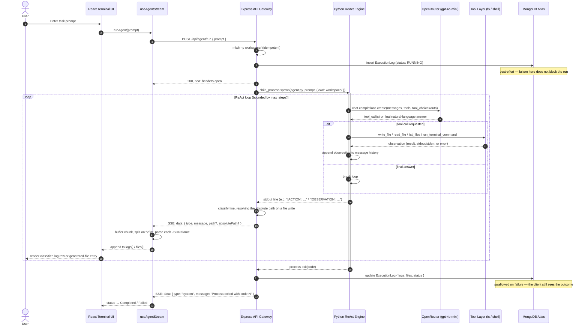

# Equinox — Autonomous Self-Correcting AI Agent Platform

**Equinox is a full-stack, real-time execution platform that lets an LLM-driven agent plan, write, and run code against a live filesystem and shell — with every action streamed to the browser and persisted for audit.**

It is not a chatbot wrapper. Equinox is three independently deployable services wired together around a durable execution contract: a **Python ReAct engine** that reasons and acts in a loop, a **Node.js/Express API gateway** that supervises the engine's subprocess lifecycle and streams its output over Server-Sent Events, and a **React SPA** that renders that stream as a structured, live execution trace — down to the exact file path and absolute location of every artifact the agent produces.

The interesting engineering here isn't the LLM call. It's everything around it: process supervision, stream framing across a subprocess boundary, defensive client-side parsing of partial network frames, and durability guarantees that hold even when the database is unavailable.

---

## Table of Contents

- [Architecture](#architecture)
- [Request Lifecycle](#request-lifecycle)
- [Design Decisions & Trade-offs](#design-decisions--trade-offs)
- [Repository Structure](#repository-structure)
- [Local Setup](#local-setup)
- [Environment Variables](#environment-variables)
- [SSE Event Contract](#sse-event-contract)
- [Known Limitations & Roadmap](#known-limitations--roadmap)

---

## Architecture

Equinox is a decoupled monorepo of three services, each with a single, clear responsibility:

| Service | Stack | Responsibility |
|---|---|---|
| **`Engine/`** | Python, OpenAI SDK (via OpenRouter) | Runs the ReAct (Reason + Act) loop against `gpt-4o-mini`, calling explicit tools (`write_file`, `read_file`, `list_files`, `run_terminal_command`) and feeding their observations back into the reasoning context until the task is complete or a step budget is exhausted. |
| **`backend/`** | Node.js, Express, TypeScript, Mongoose | Stateless API gateway. Validates requests, spawns the Python engine as a child process rooted in a dedicated workspace, forwards its stdout/stderr as Server-Sent Events, and persists execution traces to MongoDB Atlas on a best-effort basis. |
| **`frontend/`** | Vite, React, TypeScript, Tailwind CSS | Consumes the SSE stream through a custom `useAgentStream` hook, classifies log lines by type (action / observation / system / error / file-write), and renders a live execution console alongside a dedicated panel that surfaces exactly where each generated file was saved. |

There is no shared runtime and no shared memory between the three — the only contract between them is the HTTP request and the SSE event schema documented below. That boundary is deliberate: it means the engine can be redeployed, rewritten in another language, or run in a different execution environment without the gateway or UI changing at all.

## Request Lifecycle

The full path from a user's prompt to a persisted execution trace:



## Design Decisions & Trade-offs

**Server-Sent Events over WebSockets.** The data flow here is strictly unidirectional — the engine talks, the browser listens. SSE gives us that over plain HTTP: no upgrade handshake, automatic reconnect semantics built into the `EventSource` model, trivial traversal through corporate proxies and load balancers that assume plain HTTP/1.1, and a much smaller server-side footprint than maintaining a full-duplex socket per run. WebSockets would have bought us nothing here except protocol complexity we'd never use.

**A decoupled Node.js gateway in front of a Python execution engine.** The gateway's job — request validation, process supervision, stream multiplexing, persistence — is I/O-bound and benefits from Node's event loop. The engine's job — LLM orchestration, arbitrary file I/O, arbitrary shell execution — is a fundamentally different, heavier, and more dangerous workload. Keeping them as separate processes connected by `child_process.spawn` means the execution engine can crash, hang, or be replaced independently of the API layer that serves it, and the gateway never has to load Python's dependency surface into its own process.

**Defensive SSE parsing on the client.** TCP doesn't respect message boundaries, and neither does `fetch`'s streaming reader — a single SSE frame can arrive split across two `read()` calls, and two frames can arrive concatenated in one. `useAgentStream` accumulates raw chunks into a buffer, splits only on the SSE frame delimiter (`\n\n`), and re-queues the last (possibly incomplete) segment for the next read instead of parsing it prematurely. Every `JSON.parse` is wrapped so a single malformed frame degrades to a logged warning, not a dead stream.

**A dedicated, git-ignored workspace directory.** Early iterations spawned the engine with whatever working directory the Node process happened to inherit, so generated files landed wherever `npm run dev` was invoked from — polluting the backend's own source tree. The gateway now resolves paths relative to its own module location (not `process.cwd()`), guarantees a `workspace/` directory exists at the repo root, and roots the child process there explicitly via `spawn(..., { cwd })`. Every `write_file` call the engine makes is reported back to the client with both its workspace-relative and fully resolved absolute path.

**Persistence is best-effort, not a hard dependency.** An unreachable MongoDB Atlas cluster (IP allowlist drift, network partition, cold start) must not turn into a 500 on every run. Execution-log creation and finalization are each wrapped independently, so a database outage degrades the platform to "no audit trail" rather than "no service."

## Repository Structure

```
Equinox/
├── Engine/                          # Python ReAct execution engine
│   ├── agent.py                     # Orchestrates the reasoning/acting loop against OpenRouter
│   ├── tools.py                     # Tool implementations: read_file, write_file, list_files, run_terminal_command
│   ├── requirements.txt
│   ├── dockerfile                   # Container image for the engine (see Roadmap — not yet wired into the request path)
│   └── README.md
│
├── backend/                         # Node.js / Express / TypeScript API gateway
│   ├── src/
│   │   ├── controllers/
│   │   │   └── agentController.ts   # Spawns the engine, streams SSE, persists execution traces
│   │   ├── routes/
│   │   │   └── agentRoutes.ts       # POST /api/agent/run
│   │   ├── models/
│   │   │   └── ExecutionLog.ts      # Mongoose schema: prompt, logs[], files[], status, createdAt
│   │   └── server.ts                # Express bootstrap, CORS, Mongo connection with graceful fallback
│   ├── package.json
│   └── tsconfig.json
│
├── frontend/                        # Vite / React / TypeScript single-page application
│   ├── src/
│   │   ├── components/
│   │   │   ├── AppHeader.tsx        # Branding + live run status indicator
│   │   │   ├── ExecutionLogPanel.tsx# Classified, Markdown-aware execution log
│   │   │   ├── GeneratedFilesPanel.tsx # Live list of written files with resolved paths
│   │   │   ├── PromptBar.tsx        # Task input
│   │   │   └── TerminalUI.tsx       # Composition root
│   │   ├── hooks/
│   │   │   └── useAgentStream.ts    # SSE client: chunk buffering, parsing, run state
│   │   └── config.ts                # API base URL resolution
│   ├── package.json
│   └── vite.config.ts
│
├── workspace/                       # Runtime output directory — every file the agent writes lands here
└── README.md
```

## Local Setup

**Prerequisites:** Node.js 18+, Python 3.10+, an OpenRouter API key, and a MongoDB connection string (Atlas or local `mongod` — the platform degrades gracefully without one).

```bash
# 1. Engine — install Python dependencies
cd Engine
pip install -r requirements.txt
cp .env.example .env   # set OPENROUTER_API_KEY

# 2. Backend — API gateway
cd ../backend
npm install
cp .env.example .env   # set PORT, MONGO_URI, PYTHON_PATH
npm run dev             # tsx watch — http://localhost:5000

# 3. Frontend — SPA
cd ../frontend
npm install
cp .env.example .env   # set VITE_API_URL
npm run dev             # Vite dev server — http://localhost:5173
```

Once all three are running, open the frontend URL, describe a task, and watch the execution stream in real time. Every file the agent writes is saved under `workspace/` at the repo root and shown in the Generated Files panel with its full resolved path.

## Environment Variables

| Service | Variable | Description |
|---|---|---|
| `Engine/.env` | `OPENROUTER_API_KEY` | API key used to authenticate against OpenRouter for `gpt-4o-mini` completions. |
| `backend/.env` | `PORT` | Port the Express gateway listens on (default `5000`). |
| `backend/.env` | `MONGO_URI` | MongoDB connection string for execution-trace persistence. The server starts and serves requests even if this is unreachable. |
| `backend/.env` | `PYTHON_PATH` | Interpreter used to spawn the engine (default `python`). Point this at a virtualenv interpreter to isolate engine dependencies. |
| `frontend/.env` | `VITE_API_URL` | Base URL of the Express gateway the SPA talks to (default `http://localhost:5000`). |

## SSE Event Contract

Every frame streamed from `POST /api/agent/run` is a single JSON object:

```ts
type AgentEvent = {
  type: 'system' | 'log' | 'error' | 'file';
  message: string;
  path?: string;          // present only when type === 'file' — workspace-relative
  absolutePath?: string;  // present only when type === 'file' — fully resolved
};
```

- `system` — lifecycle events (engine start, workspace directory, process exit code).
- `log` — raw ReAct trace lines (`[ACTION]`, `[OBSERVATION]`, `[FINAL RESPONSE]`, step markers), classified and re-rendered by the UI.
- `error` — the engine's stderr stream.
- `file` — emitted whenever the engine's `write_file` tool succeeds, carrying the exact save location so the client never has to infer it from log text.

## Known Limitations & Roadmap

Equinox runs the agent's shell commands directly on the host process today — the provided `Engine/dockerfile` builds a container image for the engine, but the gateway does not yet route execution through it. This is the primary gap between the current implementation and a production-grade sandbox, and it's the top of the roadmap:

- **Per-run container isolation.** Pool short-lived Docker (or gVisor/Firecracker) containers per execution instead of spawning the engine on the host, so `run_terminal_command` can never touch the host filesystem or network.
- **Hard resource ceilings.** Enforce CPU and memory `cgroups` limits per container so a runaway or adversarial task can't exhaust host resources.
- **Multi-tenant workspace isolation.** All runs currently share a single `workspace/` directory with no session or user boundary. Scoping each run to an isolated, authenticated workspace (with a real user/session model — none exists yet) is required before this is safe for concurrent, multi-user use.
- **Bidirectional interactive stdin.** `run_terminal_command` is fire-and-forget with a fixed timeout; there's no way for the agent (or a human-in-the-loop) to respond to an interactive prompt (`y/N`, a REPL, a debugger) mid-command.
- **Structured retry/backoff for the LLM call.** The engine retries transient OpenRouter failures with fixed exponential backoff; this should move to a jittered strategy with a circuit breaker once run volume justifies it.
- **Execution log query API.** `ExecutionLog` documents are written today but never read back — there's no endpoint yet to list or replay past runs from the UI.
